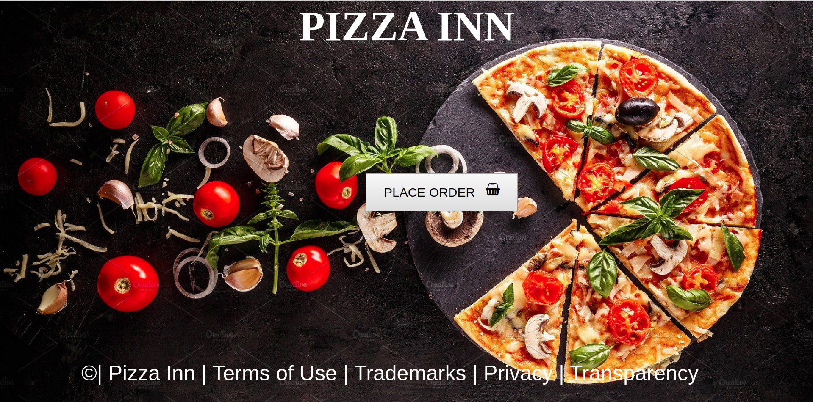

## PROJECT NAME
 - PIZZA
 ## Author's Name
 - oliver kiplagat
 
## Setup instructions 
 - git clone or download the zip file.

 - Extract the zip file.

 - cd project folder.

 - launch the index.html file.

## Technology Used
 - HTML-We used html for displaying the content.
 - CSS-We used css and bootstrap for styling the front-end of the website and making the landing page.
 - JAVASCRIPT-We used javascript for dynamics.

## BDD.
  

  - At the home page you will just press the order button and it will take you to our favorite options of pizza.

   

   

   - At the favorites you can select the size, toppings and the crust and the checkout to get the total. 

## Project's live Link
 - Github link:
## Contact information.
 - Email: oliverkiplagat25@gmail.com
 - Phone-No: 0718551651
## License and Copyright information.
 - MIT License Copyright (c) 2021 (oliver kiplagat)
 